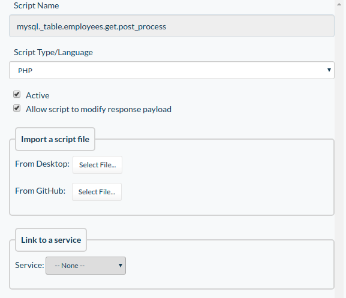
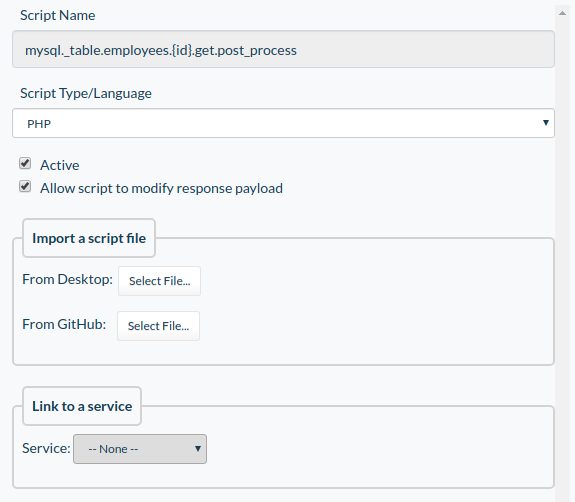
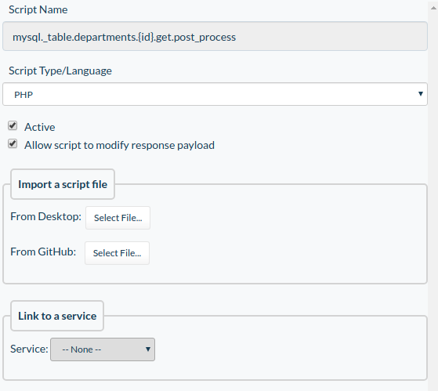

# Demo PWA
## Project setup

### Setup database:
For this application was used [MySQL example employee database](https://dev.mysql.com/doc/employee/en/). In the default MySQL employees example database was changed some tables and added a few new tables.

For setting up the database follow the next steps:
1. Open docker-compose.yaml and change data for database if you need it. 
2. Open "database" folder path in shell.
3. Execute next command for running mysql in docker
    ```
    docker-compose up -d
    ```
   '-d' for detached mode. 
4. Unzip archive mysql-employee-example-database.zip that contains database.
5. Copy database into container with database
    ```
     docker cp mysql-employee-example-database/ <DATABASE CONTAINER NAME>:home/
    ```
6. Open container in bash
    ```
     docker exec -it <DATABASE CONTAINER NAME> bash
    ```   
7. Go inside folder with database.
8. Execute the next command for creating employees database
    ```
    mysql -u <DATABASE USERNAME> -p -t < employees.sql
    ```
9. Configure the database in your DF using [this guide](https://guide.dreamfactory.com/docs/chapter03.html#generating-a-mysql-backed-api).

**If you dont want install mysql you can just use 4, 7, 8 and 9 commands.**   

### Configuring Okta
To configuring Okta for your app use [this guide](https://guide.dreamfactory.com/docs/chapter04.html#authenticating-with-okta).

### DF Scripts
Scripts are used to hiding the last 4 symbols in the phone numbers on the employee page and for search.

First of all, go to the scripts tab in your DF.

1. Script that will hide the last 4 symbols in phone number:
    * Go to the next way to hide the last 4 symbols in number for all employees:
        ```
        mysql > mysql._table.{table_name} > mysql._table.{table_name}.get.post_process > mysql._table.employees.get.post_process
        ```
       Then configure a script:
       
       
    
        After that copy and paste this code in the script field:
        ```
        $records = $event['response']['content']['resource'];
        
        foreach($records as $index => $record){
            $record['telephone'] = str_replace(substr($record['telephone'], -4), '****', $record['telephone']);
            $records[$index] = $record;
        }
        
        $event['response']['content']['resource'] = $records; 
        ```
   
   * Go to the next way to hide the last 4 symbols in phone number for one employee:
       ```
       mysql > mysql._table.{table_name}.{id} > mysql._table.{table_name}.{id}.get.post_process > mysql._table.employees.{id}.get.post_process
       ```
       Then configure a script:
       
        
     
       After that copy and paste this code in the script field:
       ```
       $record = $event['response']['content'];
       $record['telephone'] = str_replace(substr($record['telephone'], -4), '****', $record['telephone']);
       
       $event['response']['content']= $record;
       ```
    
2. To create a script for search go to the next way: 
    ```
    mysql > mysql._table.{table_name}.{id} > mysql._table.{table_name}.{id}.get.post_process > mysql._table.departments.{id}.get.post_process
    ```
    
    Then configure a script:
    
    
    
    After that copy and paste this code in the script field:
    ```
    $relationship_name = 'employees_by_dept_emp';
    $related_filter_name = 'employees_by_dept_emp_filter';
    $related_service_name = 'mysql';
    $related_table_name = 'employees';
    $related_id_field = 'emp_no';
    $related_endpoint = $related_service_name . '/_table/' . $related_table_name;
    $options = [];
    $options['parameters'] = [];
    $params = $event['request']['parameters'];
    $get = $platform['api']->get;
                
    function map($record)
    {
        return $record['emp_no'];
    }
    
    if (isset($params['related'])) {
        if (isset($params[$related_filter_name])) {
            if (isset($params['related'][$relationship_name])) {
                $options['parameters']['fields'] = $related_id_field;
                $options['parameters']['filter'] = $params[$related_filter_name];
                $related_result = $get($related_endpoint, null, $options);
    
                $result = [];
                $filteredEmployee = $related_result['content']['resource']; 
                $deptEmp = $event['response']['content'][$relationship_name];
                
                preg_match('/.*\%(.*)\%/m', $options['parameters']['filter'], $matches);
                
                if ($matches[1] !== '') {
                    foreach($deptEmp as $dEmployee){
                    foreach($filteredEmployee as $fEmployee) {
                        if($dEmployee['emp_no'] === $fEmployee['emp_no']) {
                            $result [] = $dEmployee;
                        }
                    }
                }
                $event['response']['content'][$relationship_name] = $result;
                }
            }
        }
    }
    ```
   
### DF Mailgun
For send support email used DF Mailgun feature.

1. Create Mailgun account [here](https://www.mailgun.com/).
2. Create DF Mailgun connector using [this guide](http://wiki.dreamfactory.com/DreamFactory/Tutorials/Connecting_to_Email_Services#Mailgun_Email_Service).

### Environment:
There is a **.env.example** file in the root of the app. You would need to copy it and name it **.env** (for development) and **.env.production** (for production).
Then open them and fill all env variables with respective values.

More about environment variables [here](https://cli.vuejs.org/guide/mode-and-env.html#environment-variables). 

### Setup in dev mode:
1. Install all modules for app:
    ```
    npm install
    ```

2. Run app with compiles and hot-reloads:
    ```
    npm run serve
    ```

### Setup in Production mode:

##### Be attention. For properly register Service Worker app must be served over HTTPS in production.

#### First way - using serve package

1. Build app
    ```
    npm run build
    ```
2. Run using serve package
    ```
    serve -s dist
    ```
#### Second way - using docker  

1.  Build docker image
    ```
    docker build . -t my-app
    ```

2. Run app
    ```
    docker run -d -p 8080:80 my-app
    ```

#### ESLint
Run ```eslint --ext .js,.vue src``` to see lint problems

Add ```--fix``` flag to fix problems
